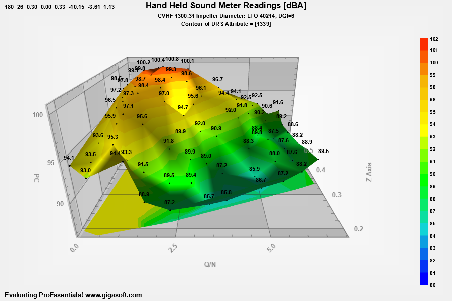

# ProEssentials WPF 3D Delaunay Heightmap — Point Cloud to 3D Surface

A ProEssentials v10 WPF .NET 8 demonstration of 3D Delaunay triangulation
using Pe3doWpf — the ProEssentials 3D scientific graph object. Loads the same
70-point acoustic survey data as [example 147](https://github.com/GigasoftInc/wpf-chart-delaunay-triangulation-contour-proessentials)
but renders it as an interactive rotating **3D heightmap surface** rather than
a 2D contour fill.



➡️ [gigasoft.com/examples/414](https://gigasoft.com/examples/414)

---

## What This Demonstrates

**70 scattered hand-held sound meter readings** (Q/N vs PC vs dBA) triangulated
into a 3D surface mesh where dBA drives both height and contour color. The
floor of the scene shows a projected 2D contour for plan-view reference —
giving you both the 3D spatial shape and the familiar 2D contour map at the
same time.

---

## Delaunay3D vs Delaunay 2D Contour

This example and [example 147](https://github.com/GigasoftInc/wpf-chart-delaunay-triangulation-contour-proessentials) use the same 70-point dataset and the same color scale — the difference is the chart object and rendering dimension:

| Feature | Example 147 | Example 414 (this repo) |
|---------|-------------|-------------------------|
| Chart object | **PesgoWpf** (Scientific Graph) | **Pe3doWpf** (3D Scientific Graph) |
| Output | 2D filled contour map | 3D rotating heightmap surface |
| Plotting method | `SGraphPlottingMethod.ContourDelaunay` | `PePlot.Option.Delaunay3D = true` + `ThreeDGraphPlottingMethod.Four` |
| Value axis | Z (contour color only) | Y (both height and contour color) |
| Column mapping | X / Y / Z | X / Z / Y (Y and Z swapped) |
| Bottom projection | — | `ShowContour.BottomColors` |
| Interaction | Zoom + pan | Rotate + zoom + pan + light drag |

---

## ProEssentials Features Demonstrated

### Delaunay3D — The Boolean Toggle

```csharp
Pe3do1.PePlot.Option.Delaunay3D = true;
Pe3do1.PePlot.Method = ThreeDGraphPlottingMethod.Four; // Surface With Contour
```

`Delaunay3D` is a boolean flag on the default surface mode — it is **not** a
separate `PolyMode`. Set it before the plotting method.

`ThreeDGraphPlottingMethod.Four` renders the triangulated mesh as a solid
colored surface with contour bands overlaid.

### Data Model — XYZ Column Swap vs Example 147

```csharp
Pe3do1.PeData.Subsets = 1;   // always 1 for Delaunay3D
Pe3do1.PeData.Points  = 70;

// Column mapping (note swap of Y and Z compared to example 147):
float fX = float.Parse(columns[0], ...);  // Q/N — horizontal X axis
float fZ = float.Parse(columns[1], ...);  // PC  — depth axis
float fY = float.Parse(columns[2], ...);  // dBA — HEIGHT (the value axis)

Pe3do1.PeData.X[0, p] = fX;
Pe3do1.PeData.Y[0, p] = fY;  // Y is always height in Pe3do
Pe3do1.PeData.Z[0, p] = fZ;
```

In Pe3do, **Y is always the vertical/height axis**. Loading dBA into Y means
the surface elevation directly represents sound level — the taller the peak,
the louder the reading.

### 3D Graph Annotations

```csharp
Pe3do1.PeAnnotation.Graph.X[p]    = fX;
Pe3do1.PeAnnotation.Graph.Y[p]    = fY;
Pe3do1.PeAnnotation.Graph.Z[p]    = fZ;   // Z coordinate needed in 3D space
Pe3do1.PeAnnotation.Graph.Type[p] = (int)GraphAnnotationType.SmallDotSolid;
Pe3do1.PeAnnotation.Graph.Text[p] = string.Format("{0:##0.0}", fY);
```

3D annotations require X, Y, **and Z** coordinates — unlike 2D annotations in
example 147 which only need X and Y. The text labels float in 3D space at each
measurement location and rotate with the surface.

```csharp
Pe3do1.PeAnnotation.Graph.LeftJustificationOutside = true; // smart label placement
Pe3do1.PeAnnotation.Graph.SymbolObstacles          = true; // avoid overlaps
Pe3do1.PeAnnotation.Graph.AnnotationTextFixedSize  = true; // consistent size at all zoom levels
```

### Manual Contour Range — Pe3do vs Pesgo Syntax

```csharp
// Pe3do — uses PePlot.Option:
Pe3do1.PePlot.Option.ManualContourScaleControl = ManualScaleControl.MinMax;
Pe3do1.PePlot.Option.ManualContourMin          = 80.0F;
Pe3do1.PePlot.Option.ManualContourMax          = 102.0F;

// Pesgo — uses PeGrid.Configure (different path, same intent):
// Pesgo1.PeGrid.Configure.ManualScaleControlZ = ManualScaleControl.MinMax;
```

This is a key API difference between Pe3do and Pesgo for contour range control.

### Bottom Contour Projection

```csharp
Pe3do1.PePlot.Option.ShowContour = ShowContour.BottomColors;
```

Projects a colored 2D contour onto the floor of the 3D scene. This gives
a plan-view reference as you rotate the surface — you can see both the 3D
shape and the 2D spatial distribution simultaneously.

### Camera and Lighting

```csharp
Pe3do1.PePlot.Option.DxZoom              = .3F;   // camera distance
Pe3do1.PeUserInterface.Scrollbar.ViewingHeight    = 26;   // vertical tilt
Pe3do1.PeUserInterface.Scrollbar.DegreeOfRotation = 180;  // initial rotation
Pe3do1.PeGrid.Option.GridAspectY         = .5F;   // compress Y scale

Pe3do1.PeFunction.SetLight(0, -9.0F, -3.2F, 1.0F);
Pe3do1.PePlot.Option.LightStrength       = .35F;
```

### Pe3do Finalization Sequence

```csharp
// Pe3do requires all three — in this order:
Pe3do1.PeFunction.Force3dxVerticeRebuild      = true;
Pe3do1.PeFunction.Force3dxAnnotVerticeRebuild = true;  // required when annotations present
Pe3do1.PeFunction.ReinitializeResetImage();
Pe3do1.Invalidate();
Pe3do1.Refresh();  // Pe3do often needs explicit Refresh()
```

`Force3dxAnnotVerticeRebuild` is required in addition to `Force3dxVerticeRebuild`
whenever 3D graph annotations are present.

---

## Data File

`DelaunaySample.txt` — 70 lines, space-delimited, three columns per line.

Column mapping for Pe3do (differs from example 147):

| Column | Maps to | Meaning |
|--------|---------|---------|
| 1 | X | Q/N — flow coefficient |
| 2 | Z | PC — pressure coefficient (depth axis) |
| 3 | Y | dBA — sound level (height axis) |

Copied to the output directory automatically on build.

---

## Controls

| Input | Action |
|-------|--------|
| Left-click drag | Rotate |
| Left-click drag + Shift | Pan / translate |
| Mouse wheel | Zoom in / out |
| Middle-button drag | Rotate light source |
| Double-click | Start / stop auto-rotation |
| Right-click | Context menu — export, print, customize, annotations |

---

## Prerequisites

- Visual Studio 2022
- .NET 8 SDK
- Internet connection for NuGet restore

---

## How to Run

```
1. Clone this repository
2. Open DelaunayHeightmap.sln in Visual Studio 2022
3. Build → Rebuild Solution (NuGet restore is automatic)
4. Press F5
```

---

## NuGet Package

References
[`ProEssentials.Chart.Net80.x64.Wpf`](https://www.nuget.org/packages/ProEssentials.Chart.Net80.x64.Wpf).
Package restore is automatic on build.

---

## Related Examples

- [WPF Delaunay 2D Contour — Example 147](https://github.com/GigasoftInc/wpf-chart-delaunay-triangulation-contour-proessentials)
- [WPF Heatmap Spectrogram — Grid-Based Contour](https://github.com/GigasoftInc/wpf-chart-heatmap-spectrogram-proessentials)
- [WPF Quickstart — Simple Scientific Graph](https://github.com/GigasoftInc/wpf-chart-quickstart-proessentials)
- [3D Realtime Surface — ComputeShader](https://github.com/GigasoftInc/wpf-3d-surface-realtime-computeshader-proessentials)
- [All Examples — GigasoftInc on GitHub](https://github.com/GigasoftInc)
- [Full Evaluation Download](https://gigasoft.com/net-chart-component-wpf-winforms-download)
- [gigasoft.com](https://gigasoft.com)

---

## License

Example code is MIT licensed. ProEssentials requires a commercial
license for continued use.
